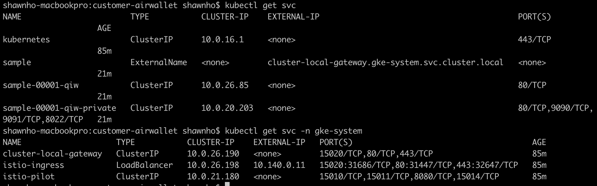
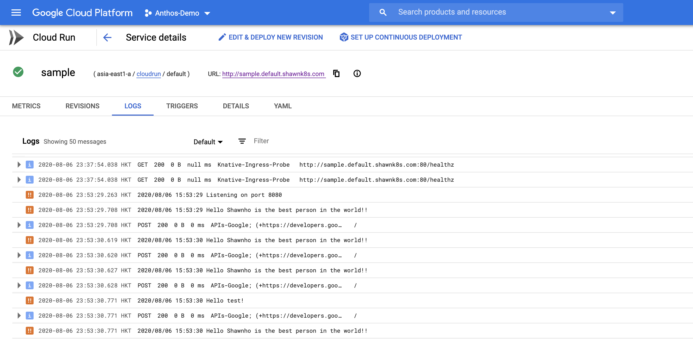

## Create a well-protected CloudRun service
GCP Cloudrun service is one of the best serverless platform, which provide developer an easy way to execute their code on a production environment. Recently, Google also opensourced a [Knative project](https://knative.dev/docs/), which is the basis of Cloudrun on Anthos. 
 
GCP provides 2 type of CloudRun services, managed or GKE based. The managed Cloudrun's service FQDN is always internet-facing, which is against some customers' internal security policy. This project is intended to utilize CloudRun on Anthos to produce a service with private FQDN and utilize GCLB to provide internet facing FQDN. The benefits for using GCLB is there are managed security services (e.g. CloudArmor) which could be applied along with GCLB to provide better protection. 

In addition to demonstrate GCLB with Cloudrun on Anthos, we'll also show case how to use pub/sub to trigger CloudRun service. Pub/Sub service is GCP's messaging services to use topic/subscription to trigger desired actions. The entire project is organized in 4 scripts:

1. env.sh: environmental variables used for this project. User must change the variables to fit to your own project. 

2. 0-init.sh: this file is meant to run only once. It will open pub/sub service, produce GCLB IP and ssl-certificate, and compile the desired base images used in this lab. After the script is executed, please setup a DNS entry to map GCLB's IP to its FQDN. 

3. 1-create-cluster.sh: this file is used to create GKE cluster which is preconfigured for this project.

4. 2-config-gclb.sh: this file will deploy a HelloWorld project on Cloudrun, enforce this service a private ip, and produce a GCLB to connect to it. Once the script finished, you could curl https://[FQDN] to see "Hello World" replied string. 

5. 3-config-pubsub.sh: this file will replace HelloWorld service with a pubsub service. It will also setup pub/sub's topic and subscription. Follow the instruction in the script to see the result. 
. 

6. 99-clean-all.sh: this file will remove all setups in this lab, except for static-ip, ssl-certificate, and two images built in 0-init.sh. These four items requires manually removal. 
